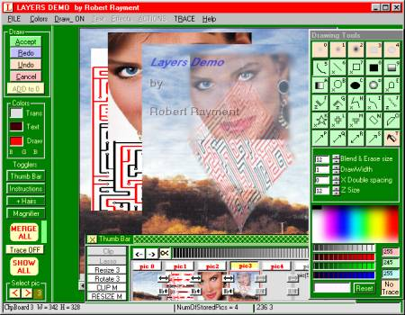



## Layers Demo\(Update5\)

### Description

Layers Demo by Robert Rayment. (Update5 fileops correction) This started as a layers demo but grew a bit to include some effects and drawing tools. Individual pictures can be resized, clipped, lassoed, rotated have effects and drawn on and a merged picture can also have all these apart from lassoing and rotating. The transparency can be varied for each picture apart from the background...etc. Too many things to describe them all here so please read the Help. The screenshot was made with this prog but PSPro used to convert to jpeg. Difficult to be sure all bugs removed so comments welcome. (exe tested on WinXP) Win98, Zip 182 KB including some test pictures.
 
### More Info
 
Pictures

Read Help

             |
---                |---
**Submitted On**   |2003-08-15 06:29:48
**By**             |[Robert Rayment](https://github.com/Planet-Source-Code/PSCIndex/blob/master/ByAuthor/robert-rayment.md)
**Level**          |Advanced
**User Rating**    |5.0 (109 globes from 22 users)
**Compatibility**  |VB 6\.0
**Category**       |[Complete Applications](https://github.com/Planet-Source-Code/PSCIndex/blob/master/ByCategory/complete-applications__1-27.md)
**World**          |[Visual Basic](https://github.com/Planet-Source-Code/PSCIndex/blob/master/ByWorld/visual-basic.md)
**Archive File**   |[Layers\_Dem1630548162003\.zip](https://github.com/Planet-Source-Code/robert-rayment-layers-demo-update5__1-47451/archive/master.zip)

### API Declarations

Several

